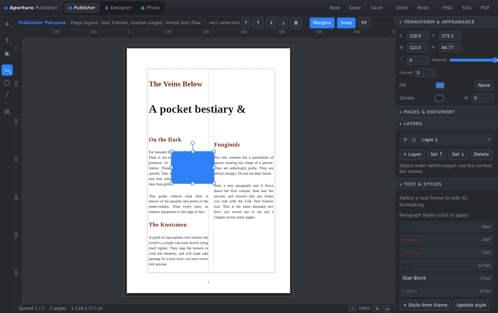
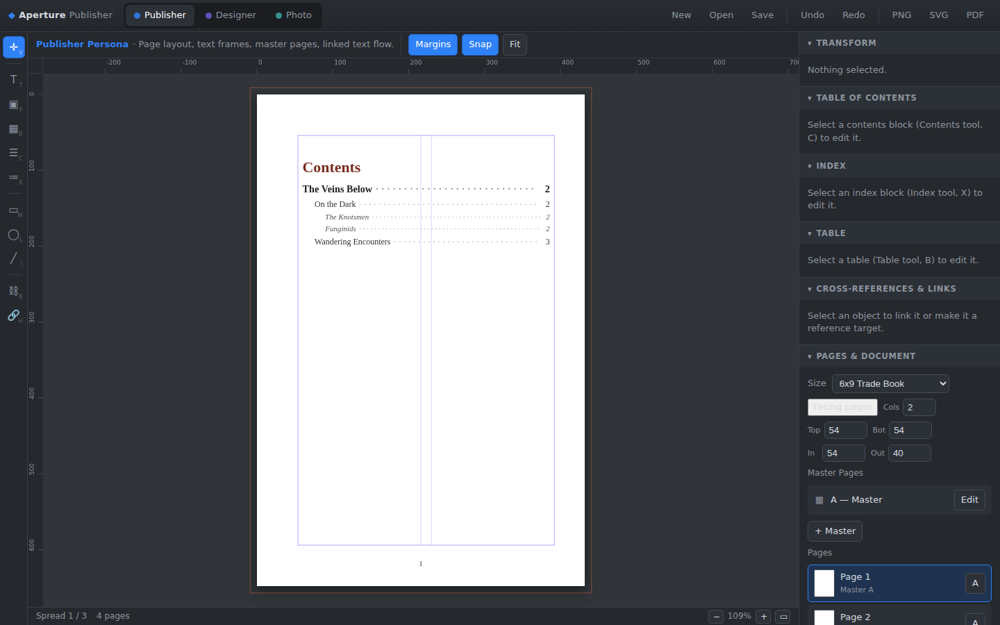
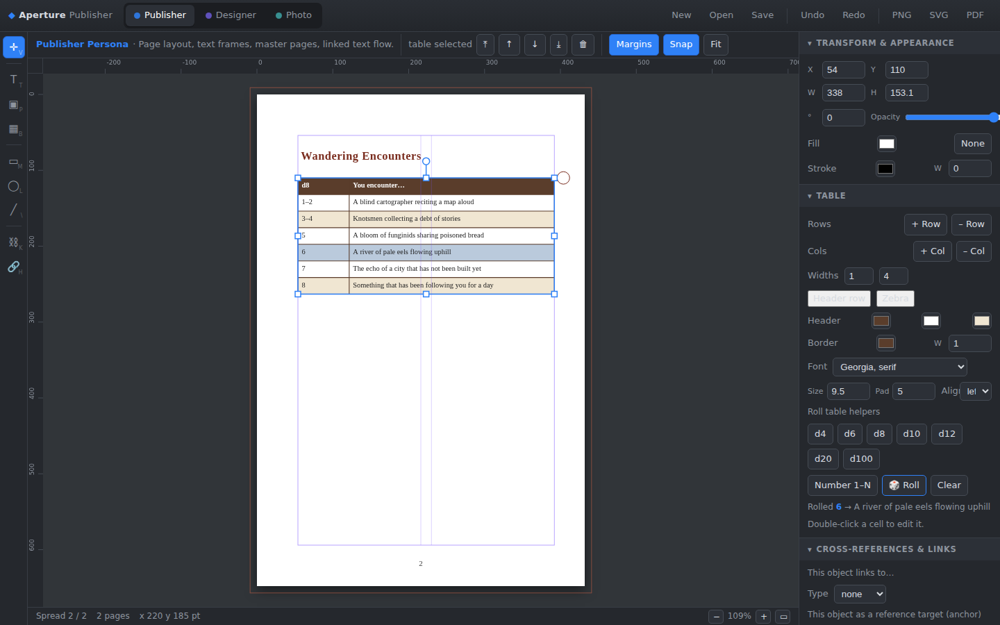
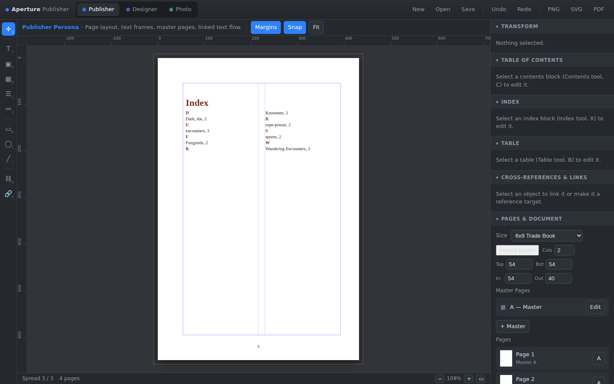
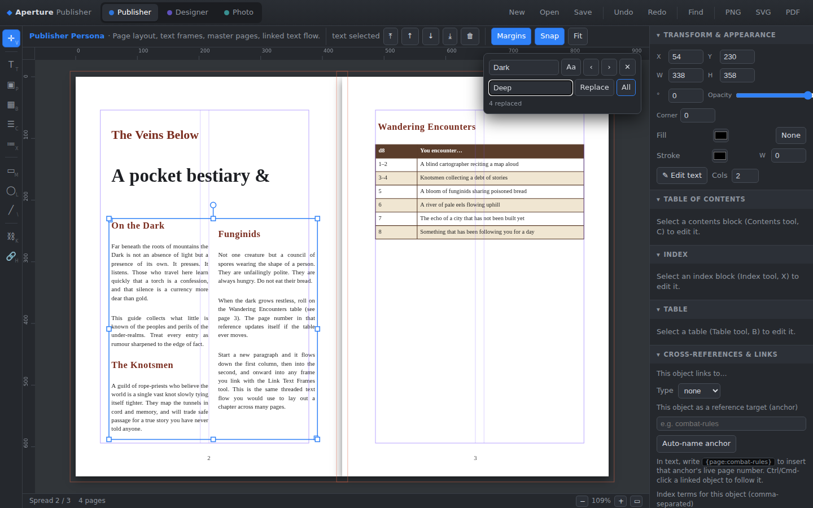

# Aperture Publisher

A browser-based **desktop-publishing app** that replicates the core of Affinity
Publisher — including **StudioLink** persona switching — with zero build step and
zero dependencies. Built for laying out long-form documents like an RPG rulebook.



## Run it

It is a static ES-module app, so it needs to be served over HTTP (modules don't
load from `file://`):

```sh
cd publisher
python3 -m http.server 8099
# then open http://localhost:8099
```

Any static server works (`npx serve`, VS Code Live Server, etc.).

## StudioLink personas

The toolbar at the top switches the active **persona** without leaving the
document — the heart of Affinity's StudioLink. Each persona swaps the toolset and
panels while editing the *same* pages:

| Persona | Focus | Tools | Panels |
| --- | --- | --- | --- |
| **Publisher** | Page layout & text | Move, Text Frame, Picture Frame, **Table**, **Contents**, **Index**, Rect, Ellipse, Line, **Link Text Frames**, **Hyperlink** | Transform, Table of Contents, Index, Table, Cross-References & Links, Pages, Layers, Text & Styles, Color |
| **Designer** | Vector drawing | Move, Node, Rect, Ellipse, Line, Pen, Text | Transform, **Arrange & Align**, Layers, Color |
| **Photo** | Raster images | Move, Picture Frame, Crop, Adjust | Transform, **Image Adjustments**, Layers |

Switch with the buttons or keys **1 / 2 / 3**.

## Features

- **Document & pages** — facing-page spreads, multiple page sizes (A4, Letter,
  6×9 trade, digest…), margins, bleed, and multi-column page guides.
- **Master pages** — edit a master, apply it to pages, with **automatic page
  numbers** that update per page.
- **Text frames** — multi-column text, paragraph styles, and **linked text flow
  (threading)**: link frames with the chain tool and a story flows column-to-column
  and frame-to-frame. Lightweight markup — start a line with `# ` or `## ` for
  headings — lets one story mix styles.
- **Table of contents** — a generated **Contents** block built by scanning your
  `#`/`##`/`###` headings. Choose which levels to include, and give each heading
  level its **own style** — size, colour, bold/italic, indent, and whether it shows
  a page number — so chapter titles, sections, and sub-sections read as a clear
  hierarchy. Entries use **dot leaders** and **live page numbers**. Click
  **Generate / Refresh** after writing or repaginating, double-click an entry to
  jump to its page, and the TOC exports as clickable links in the PDF. (The starter
  document ships with one as front matter — note the page numbers update when
  content moves.)





- **Index** — a generated back-of-book **Index**. Mark terms inline in text with
  invisible **`{index:Term}`** tokens, or tag any object with index terms in the
  Cross-References & Links panel. Generate an alphabetised, letter-grouped,
  multi-column index with merged page numbers ("Knotsmen, 4, 7, 12"). Double-click
  an entry to jump to its first page; entries are clickable in the PDF.



- **Tables** — purpose-built for **roll tables**. Header row, zebra striping,
  borders, per-column widths, and double-click cell editing with auto-fit row
  heights. One-click **dice presets** (d4–d100) fill the first column `1..N`, and
  a **🎲 Roll** button rolls against the first-column ranges (e.g. `6–14`) and
  highlights the result. **Long tables flow across pages**: link one table into
  another with the chain tool and rows paginate automatically with the **header
  row repeated** on every frame.
- **Hyperlinks & cross-references** — give any object a link to a **page**, a
  named **anchor**, or an external **URL**, and Ctrl/Cmd-click (or the *↪ Go*
  button) to follow it. Inline **`{page:anchor-name}`** tokens in text resolve to
  the target's **live page number** ("see page 42") and update if it moves. Links
  and anchors are exported as real clickable links in the PDF.
- **Find & replace** — a document-wide find bar (Ctrl/Cmd+F) that searches every
  text frame and table cell. Step through matches (Enter / F3), each highlighted in
  place, and **Replace** or **Replace All** (Ctrl/Cmd+H), with a match-case toggle.



- **Paragraph styles** — apply, create-from-frame, and redefine; full character
  controls (font, size, leading, tracking, alignment incl. justify, colour).
- **Vector objects** — rectangles (with corner radius), ellipses, lines, with
  fill/stroke and per-object opacity.
- **Picture frames** — place images, fit modes (cover/contain/fill), and Photo
  persona adjustments (brightness/contrast/saturation/grayscale).
- **Layers** — visibility, lock, naming, plus object stacking order.
- **Transform** — precise X/Y/W/H, rotation, and on-canvas move/resize/rotate with
  snapping to margins and page guides.
- **Arrange** — align and distribute multiple objects.
- **Color & swatches** — swatch grid, custom picker, fill/stroke targeting.
- **Undo/redo**, rulers, zoom/pan, and a marquee selection.
- **I/O** — save/open native `.apub` projects (JSON), and export the current
  spread to **PNG** or **SVG**, or the whole document to **PDF** (via print).

## Keyboard shortcuts

| | |
| --- | --- |
| `V` Move · `T` Text · `P` Picture · `B` Table · `C` Contents · `X` Index · `M` Rect · `L` Ellipse · `\` Line · `K` Link frames · `H` Hyperlink | tools (per persona) |
| `1` / `2` / `3` | Publisher / Designer / Photo persona |
| `Ctrl/Cmd Z` · `Ctrl/Cmd Shift Z` | undo / redo |
| `Ctrl/Cmd F` · `Ctrl/Cmd H` · `Ctrl/Cmd G` / `F3` | find · replace · find next |
| `Ctrl/Cmd S` · `Ctrl/Cmd O` | save / open |
| `Ctrl/Cmd =` · `Ctrl/Cmd -` · `F` | zoom in / out / fit |
| `Delete` | delete selection |
| Arrows (`Shift` = ×10) | nudge selection |
| `PageUp` / `PageDown` | previous / next spread |
| `[` / `]` | send backward / bring forward |
| Drag · double-click text · hold `Space` to pan · `Ctrl`+wheel to zoom | canvas |

## Linked text flow, quickly

1. Draw two (or more) **Text Frames** with the Text tool.
2. Pick the **Link Text Frames** tool (chain icon, `K`).
3. Click the first frame, then the second — overflowing text now flows into it.
   Repeat to thread a chapter across as many frames/pages as you like.

## Roll tables, quickly

1. Pick the **Table** tool (`B`) and drag out a table (it starts as a d20 stub).
2. In the **Table** panel, click a die preset (e.g. **d8**) to make it a d8 table
   with the first column filled `1..8`. Adjust the first column to ranges like
   `1–3` if results span multiple numbers.
3. Double-click any cell to edit it; add rows/columns and set column widths,
   header colours, zebra striping, and borders in the panel.
4. Click **🎲 Roll** to roll and highlight the matching row.

## Table of contents, quickly

1. Write your chapters/sections using heading markup — start a line with `# `,
   `## `, or `### ` (the same markup the styles use).
2. Pick the **Contents** tool (`C`) and drag out a block (usually on a front
   page). It generates immediately from the current headings.
3. In the **Table of Contents** panel choose which levels to include (H1/H2/H3),
   set the title, fonts, and leader character, and style each level in the
   **Per-level style** rows (size · colour · **B** · *I* · indent · `#` page-number).
4. After editing headings or when pagination changes, click **Generate /
   Refresh**. Double-click any entry to jump to its page; entries become clickable
   links in the exported PDF.

## Index, quickly

1. Mark terms where they matter: type `{index:Knotsmen}` right after the word in a
   text frame (the token is invisible in the output), or select any object and add
   comma-separated terms in the **Cross-References & Links** panel.
2. Pick the **Index** tool (`X`) and drag out a block on a back page.
3. In the **Index** panel set columns and toggle **Group A–Z**, then click
   **Generate / Refresh**. Terms are alphabetised with merged page numbers.
4. Double-click an entry to jump to its first page.

## Long tables across pages, quickly

1. Draw the table and fill in the rows (it can be taller than the page).
2. Draw a second, empty table where the overflow should continue (e.g. the next
   page), sized to the space you want it to fill.
3. Pick the **Link Text Frames** tool (`K`) and click the first table, then the
   second. Rows now flow into the second frame and the **header row repeats** at
   the top of it. Chain as many frames as you need.

## Cross-references, quickly

- **Auto page numbers in text:** anchor the target object (select it → *Cross-
  References & Links* panel → type an anchor name, e.g. `wandering-table`), then
  in any text frame write `… (see page {page:wandering-table})`. It renders the
  live page number and updates if the table moves.
- **Clickable jumps:** select an object, set its link to a page / anchor / URL in
  the same panel — or use the **Hyperlink** tool (`H`): click the source object,
  then the target, to wire a cross-reference in one gesture. Ctrl/Cmd-click a
  linked object (or press *↪ Go*) to follow it. Links survive into the PDF export.

## Architecture

Plain ES modules, no framework:

| File | Responsibility |
| --- | --- |
| `src/store.js` | App state, spreads/derived selectors, undo-redo history |
| `src/model.js` | Document/object factories, presets, default styles |
| `src/personas.js` | StudioLink personas and tool definitions |
| `src/textlayout.js` | Wrapping, columns, paragraph styles, threading, cross-reference tokens, heading & index collection |
| `src/renderer.js` | Canvas drawing, table pagination, TOC/index layout, hit-testing, selection chrome |
| `src/interaction.js` | Pointer tools: select/move/resize/rotate/create/thread/cell-edit/link |
| `src/panels.js` | Persona switcher, tool strip, context bar, studio panels (incl. Table & Links) |
| `src/find.js` | Document-wide find & replace over text frames and table cells |
| `src/io.js` | Save/open and PNG/SVG/PDF export (with clickable PDF links) |
| `src/main.js` | Bootstrap, rulers, keyboard, render loop |

> This app is standalone and not connected to the spreadsheet tools elsewhere in
> this repo; it lives here as the eventual layout tool for the rulebook project.
